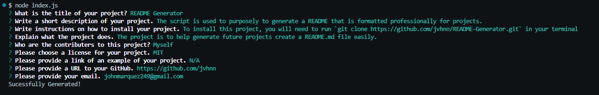

# README Generator

  

## 🧐 Description

This script is used purposely to generate a README that is formatted correctly. 

## 📒 Table of Contents

* [Installation](#installation)
* [Usage](#usage)
* [Contributing](#contributing)
* [Tests](#tests)
* [Questions](#questions)
* [License](#license)

## 🔧 Installation

To install this project, you will have to do `git clone https://github.com/jvhnn/README-Generator.git` in your terminal.

## 📦 Usage

To run this project, you will need to run `node index.js` 

From there, you will be prompted to a list of questions, you will not be able to proceed if you did not input any information. 

## 🔥 Contributing

Myself (John Marquez)

<a href="https://gist.github.com/lukas-h/2a5d00690736b4c3a7ba">lukas-h</a> for providing license badges.

## 🚀 Tests / Screenshots

<a href="https://www.youtube.com/watch?v=UQpe6XLAGIc">Demostration Video</a>

## License 

This project is licensed under the MIT License. For more information, please visit https://opensource.org/licenses/MIT.

## Questions

For any questions/ concerns, please contact me through the information provided below: 

GitHub: [https://github.com/jvhnn](https://github.com/jvhnn)

Email: <a href="mailto:johnmarquez249@gmail.com">johnmarquez249@gmail.com</a>

